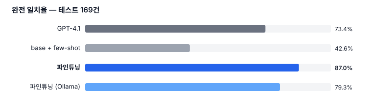
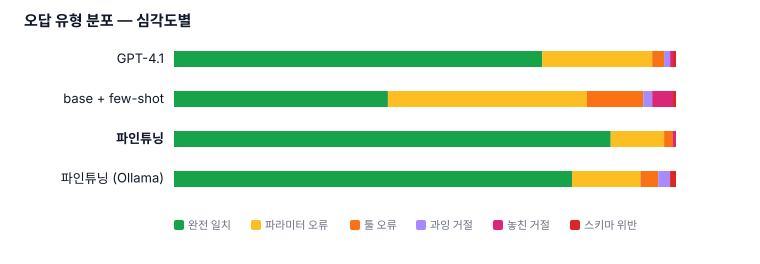
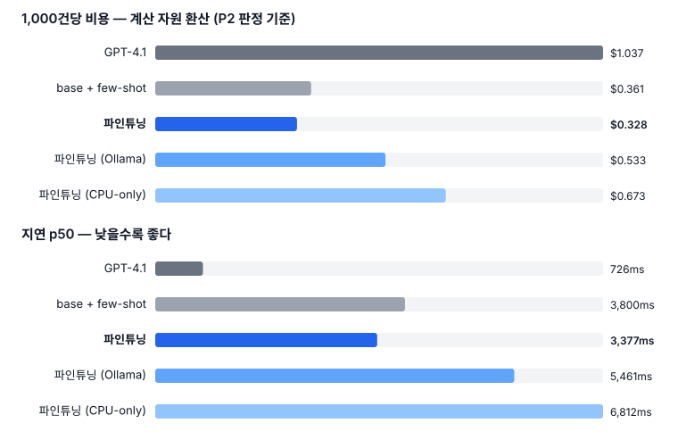

# PawNote

> **말로 남기고, 병원에서 꺼내 쓰는 반려동물 케어 기록.**
> 보호자의 한마디를 구조화된 Tool Call(JSON)로 바꾸는 **온디바이스 4B 모델**을 QLoRA로 파인튜닝하고,
> GPT-4.1 대비 정확도·지연·비용을 정량 비교했다.

```
입력   "콩이 아침에 사료 반 그릇 먹었어"

출력   {"tool": "log_meal",
        "arguments": {"food": "사료", "amount": "반 그릇",
                      "time": "아침", "caregiver": null},
        "reason": null}
```

앱은 이 JSON을 그대로 데이터베이스에 넣는다. 사용자는 폼을 채우지 않았고, 문장은 서버로 나가지 않았다.

```
완전 일치율   파인튜닝 87.0%   vs   GPT-4.1 73.4%   vs   파인튜닝 전 42.6%
입력 토큰     1,542 → 27         모델 크기  2.3GB (4비트 GGUF)
시험지        169건 · 전부 사람이 눈으로 검수
```

**Qwen3-4B-Instruct-2507** · QLoRA · 무료 Colab T4 · 7일

| [결과](#결과) | [왜 이 문제인가](#왜-이-문제인가) | [어떻게 만들었나](#어떻게-만들었나) | [설계 결정](#설계-결정--결과에-영향을-준-다섯-개) |
| --- | --- | --- | --- |
| **[데이터가 실제 작업물이다](#데이터가-실제-작업물이다)** | **[평가](#평가--왜-7분류인가)** | **[실패 사례 분석](#실패-사례-분석)** | [안전 경계](#안전-경계) · [한계](#한계) · [재현](#재현) · [문서](#문서) |

---

## 결과

테스트 **169건**, 전부 사람이 눈으로 검수한 시험지다.



### 무엇과 무엇을 비교했나

| 대상 | 무엇을 재는가 |
| --- | --- |
| GPT-4.1 + 툴 목록 프롬프트 | 현실의 **상한선** |
| 같은 4B 모델 + few-shot | 파인튜닝을 **안 한** 기준선 |
| 같은 4B 모델 + QLoRA | 이 프로젝트의 산출물 |

가운데 줄이 핵심이다. **파인튜닝 전후를 같은 모델로 재지 않으면 "파인튜닝이 기여했다"는 말이 성립하지 않는다.** 42.6% → 87.0%, **+44.4%p**가 그 기여분이다.

네 번째 열 `파인튜닝 (Ollama)`은 **같은 모델을 4비트로 양자화해 실제로 서빙한 것**이다. 폰에 올리려면 반드시 거쳐야 하는 단계라 따로 잰다.

### 착수 전에 못 박은 성공 기준

수치를 보고 기준을 만들면 무슨 결과든 성공이 된다. 그래서 **Day 0에 고정하고 사후 변경을 금지**했다.

| | 조건 | 실측 | |
| --- | --- | --- | --- |
| **P0** | 데이터 생성 → 학습 → 평가 → 서빙 완주 | 4단계 닫힘 | ✅ |
| P1 | base 대비 완전 일치율 +15%p 이상 | **+44.4%p** | ✅ |
| P1 | 스키마 위반 5% 미만 | 0.0% | ✅ |
| P1 | 툴 환각 2% 미만 | 0.0% | ✅ |
| P2 | GPT-4.1 완전 일치율의 90% 이상 | **119%** | ✅ |
| P2 | 건당 비용 1/10 이하 | 3.2배 | ❌ |
| P2 | p50 지연 더 낮음 | 3,377ms vs 726ms | ❌ |

**P2 두 칸은 실패했다.** 비용은 목표의 1/3만큼만 줄었고, 지연은 GPT-4.1이 4배 이상 빠르다.

- **비용** — 판정은 더 엄격한 기준으로 했다. 온디바이스를 "사용자 기기니까 0원"으로 두면 비교가 성립하지 않으므로, **추론에 쓴 시간을 클라우드 GPU 단가로 환산**해 값을 매겼다. GPT 쪽에는 반대로 프롬프트 캐시 할인을 적용했다. 양쪽 다 우리에게 불리한 선택이다
- **지연** — 원인이 분명하다. 아래 [결정 2는 비용을 줄였지 지연을 줄이지 않았다](#결정-2는-비용을-줄였지-지연을-줄이지-않았다) 참조

### 오답 7분류 분해

**정확도를 한 숫자로 뭉개지 않는다.** 왜 이렇게 나누는지는 [평가](#평가--왜-7분류인가) 참조.

| | GPT-4.1 | base + few-shot | **파인튜닝** | 파인튜닝 (Ollama) |
| --- | --- | --- | --- | --- |
| **완전 일치** | 73.4% | 42.6% | **87.0%** | 79.3% |
| 파라미터 오류 | 21.9% | 39.6% | 10.7% | 13.6% |
| 툴 오류 | 2.4% | 11.2% | 1.8% | 3.6% |
| **툴 환각** | 0.0% | 0.0% | **0.0%** | 0.0% |
| **스키마 위반** | 0.6% | 0.6% | **0.0%** | 1.2% |
| **파싱 실패** | 0.0% | 0.0% | **0.0%** | 0.0% |
| 과잉 거절 | 1.2% | 1.8% | 0.0% | 2.4% |
| 놓친 거절 | 0.6% | 4.1% | 0.6% | 0.0% |



**형식 안정성이 착수 전 예상대로 나왔다.** 파인튜닝 모델의 **툴 환각·스키마 위반·파싱 실패가 전부 0%**다. base 모델은 프롬프트로 툴 12개를 다 설명해줘도 스키마를 깨뜨리고 없는 툴을 지어낸다.

이 차이가 실무에서 중요한 이유가 있다. **파라미터를 하나 틀린 출력은 앱이 받아서 보정할 수 있지만, JSON이 깨진 출력은 받을 수조차 없다.**

### 비용과 지연

| | GPT-4.1 | base + few-shot | **파인튜닝** | 파인튜닝 (Ollama) |
| --- | --- | --- | --- | --- |
| 입력 토큰/건 | 1,542 | 2,094 | **27** | 31 |
| 지연 p50 | 726ms | 3,800ms | 3,377ms | 5,461ms |
| 1,000건당 비용 | $1.037 | $0.361 | **$0.328** | $0.533 |



**한쪽은 이겼고 한쪽은 졌다.** 비용은 3.2배 싸지만 지연은 4.7배 느리다. 입력 토큰을 57배 줄이고도 지연이 늘어난 이유는 [따로 적었다](#결정-2는-비용을-줄였지-지연을-줄이지-않았다).

---

## 왜 이 문제인가

감이 아니라 조사에서 시작했다. 네 갈래로 나눠 찾았다 — 국내 양육 실태조사, 해외 투약 준수 연구, 수의사 문진 가이드, 기존 기록 앱.

**국내 실태조사에서 애로사항 상위 4개 중 2개가 건강이었다.**

| 애로사항 | 비율 |
| --- | --- |
| 여행 가기 힘들다 | 37.4% |
| **건강 이상 시 대처하기 힘들다** | **34.4%** |
| 배설물·털 관리가 번거롭다 | 34.1% |
| **건강 이상을 파악하기 힘들다** | **32.9%** |

**해외 연구는 문제와 해법을 모두 숫자로 준다.**

- 개 보호자 **47%가 투약을 놓친다** (Odom 2024)
- **46~51%가 예방약을 매년 잊는다** (Merck 2025)
- 그런데 **기록 앱을 쓰면 미준수가 60% → 12.6%로 떨어진다** (Ribas 2020)

마지막 줄이 이 프로젝트의 전제다. **기록이 문제를 해결한다는 것은 이미 증명돼 있다.** 남은 문제는 기록이 안 이어진다는 것이다.

국내 기록 앱들(반기다·똑똑집사·Pawmory)은 전부 폼과 버튼 탭 방식이고, Pawmory의 셀링포인트가 **"3초 안에 기록"** 일 만큼 업계도 입력 마찰을 핵심 문제로 인식하고 있다.

> **기존 앱은 입력을 빠르게 만들었다. 이 프로젝트는 입력을 없앤다.**

산책 중이거나 밥을 주는 중에는 손이 자유롭지 않다. 그때 폼을 못 채워서 기록이 끊기고, 정작 병원에서 **"언제부터요?"** 에 답을 못 한다.

### 조사가 툴 셋을 바꾼 세 가지

툴 12개를 조사에서 역산했다. 감으로 만들었으면 아래 셋이 없었을 것이다.

| | 어디서 나왔나 |
| --- | --- |
| **`log_water`** | 수의사 문진 항목. **음수량 증가는 신장·당뇨의 초기 신호인데 보호자가 가장 안 세는 항목이다** |
| **`get_vet_summary`** | *"진료라는 긴장된 상황에서는 기억이 흐릿해진다"* 는 조언이 반복해서 나왔다. 평소 기록의 **목적**을 완성하는 툴 |
| **`caregiver` 필드** | 투약 실패 원인으로 **"여러 명이 돌보면 누가 투약했는지 불확실해진다"** 가 연구에 명시됐다 |

### 툴 12개

| 기록계 `log_*` | | 조회계 `get_*` | |
| --- | --- | --- | --- |
| `log_meal` | 식사 | `get_records` | 기록 나열 |
| `log_water` | 음수 | `get_trend` | 추세 요약 |
| `log_excretion` | 배설 | `get_care_due` | 다음에 챙길 것 |
| `log_medication` | **약이면 전부 여기** | `get_vet_summary` | 진료용 요약 |
| `log_care` | 약이 아닌 위생 관리 | | |
| `log_symptom` | 전용 칸이 없는 이상 징후 | | |
| `log_activity` | 활동 | | |
| `log_weight` | 체중 | | |

**난이도는 툴 개수가 아니라 자연어 모호성으로 확보했다.** 실제 난점은 보호자가 툴 이름과 전혀 다른 구어체로 말한다는 것이다 — `"구충제 줬어"` 가 약인지 케어인지, `"구충제 안 밀렸나?"` 가 과거를 묻는지 다음 일정을 묻는지.

전체 12개의 근거 추적표와 출처는 [context-notes.md](context-notes.md) §2에 있다.

---

## 어떻게 만들었나

```
사용자 조사 ──→ 툴 12개 역산
                    │
                    ▼
            정답 Tool Call을 코드로 균등 샘플링      ← 결정 3 역방향 생성
                    │
                    ▼
            GPT-4.1이 그 정답에 맞는 발화를 작성
                    │
                    ▼
            자동 검증 (라벨-발화 정합) → 2,360건
                    │
                    ├──→ train 1,960 ─→ QLoRA 학습 (T4 · 4시간)
                    ├──→ val 200     ─→ 설정 고르기
                    └──→ test 200    ─→ 사람 검수 → 169건 → 최종 평가 1회
```

### 왜 파인튜닝인가 — 다섯 단계

1. **산책 중에도 기록돼야 한다** — 폼·버튼으로는 손이 자유롭지 않을 때 끊긴다
2. **말로 넣으려면 오프라인이어야 한다** — 지하·시골에서 서버를 부르는 순간 그 순간을 놓친다. 게다가 매 발화마다 API를 부르면 사용자당 운영비가 감당되지 않고, 건강 기록은 사적 데이터다
3. **폰에서 돌리려면 작은 모델이어야 한다** — `4B`(파라미터 40억 개)를 `4비트 양자화`(숫자 정밀도를 낮춰 용량을 줄이는 것)로 줄이면 **2.3GB**라 폰에 올라간다
4. **작은 모델은 프롬프트로는 형식을 못 지킨다 ★** — 툴 12개 설명을 다 넣어줘도 키를 빠뜨리고 없는 툴을 지어낸다. 위 표의 base 42.6%가 그것이다. → **툴 지식을 가중치에 심는다**
5. **부수 효과 — 입력이 짧아진다** — 툴 설명을 안 넣으므로 입력이 발화 한 줄뿐이다. **1,542 → 27 토큰**

---

## 설계 결정 — 결과에 영향을 준 다섯 개

전체 17개는 [context-notes.md](context-notes.md) §3에 근거와 함께 있다. 여기서는 **숫자를 바꾼 것만** 적는다.

### 결정 2 — 툴 스펙을 프롬프트에 넣지 않는다

파인튜닝 모델에게는 **툴 목록을 주지 않는다.** 발화 한 줄만 준다. 그 차이 자체가 실험이다.

이 결정 때문에 base 모델과의 비교가 공정하지 않다고 볼 수도 있다. 그래서 **base에는 툴 12개 스펙과 few-shot 예시 8쌍을 전부 준다.** 조건이 유리한 쪽이 42.6%이고 불리한 쪽이 87.0%다.

### 결정 8 — 모델이 할 일과 규칙이 할 일을 나눈다

| 층 | 하는 일 | 담당 |
| --- | --- | --- |
| **A층** | 말하면 기록된다 | **파인튜닝 모델. 이 프로젝트의 평가 대상** |
| **B층** | 놓친 걸 알려준다 ("심장사상충 약 32일째") | **규칙 엔진. LLM 아님** |

**"마지막 투여 후 30일 경과"는 날짜 뺄셈이지 추론이 아니다.** B층을 LLM으로 만들면 진단 영역으로 미끄러지고, 애초에 필요도 없다.

> **안 쓸 곳을 아는 것도 설계다.**

### 결정 9·11 — 시간과 수량을 모델이 정규화하지 않는다

모델은 `"아침"`을 그대로 출력하고, `2026-09-01T08:00`으로 바꾸는 일은 앱 코드가 한다. `"반 그릇"`도 마찬가지다.

이유가 넷인데 그중 하나가 **측정을 위한 것**이다. 모델이 정규화까지 하면 *"시간 표현을 못 찾은 것"* 과 *"찾았으나 날짜 계산을 틀린 것"* 이 7분류표의 같은 칸에 떨어져 **파인튜닝 효과를 분리 측정할 수 없다.**

나머지 셋 — 역방향 생성에서 GPT가 날짜를 틀리면 정답이 깨진다. `"아침"`이 7시인지 8시인지는 관례이지 정답이 아니다. 자정 경계와 타임존은 발화 수신 시각을 아는 앱 코드가 틀릴 수 없다.

**다만 이 결정에는 대가가 있었다.** [양자화가 표층 복사를 먼저 잃는다](#4비트-양자화는-표층-복사를-가장-먼저-잃는다) 참조.

### 결정 10 — RAG를 쓰지 않는다

`RAG`(답하기 전에 문서를 검색해 그 내용을 근거로 답하게 하는 방식)는 **지식**을 다루는 도구인데, 이 태스크는 형식 변환이라 지식이 필요 없다.

품종별 표준 체중 같은 참조 데이터는 비정형 문서가 아니라 **구조화된 표**라서 벡터 검색이 아니라 키 조회가 맞다. 그리고 그 값으로 *"정상인가"* 를 판단하는 것은 **안전 경계 밖**이다.

### 결정 1 — 단일 Tool Call로 범위를 한정한다

순차 의존 호출(앞 호출의 실행 결과가 있어야 다음을 정하는 것)은 Agent Loop 영역이다. 실행 환경 시뮬레이션과 궤적 평가가 필요해 7일에 안 들어간다.

**대신 그 타협의 대가를 측정 가능한 형태로 남겼다** — [한계](#한계) 참조.

---

## 데이터가 실제 작업물이다

> **파인튜닝에서 코드는 거들 뿐이고, 진짜 작업물은 2,000쌍 그 자체다.**

학습 스크립트는 Unsloth 예제를 거의 그대로 쓴 30줄이다. **차이를 만드는 것은 전부 데이터 쪽이다.**

### 역방향 생성 — 정답이 틀릴 수 없는 구조

보통은 발화를 먼저 모으고 사람이 라벨을 붙인다. 이 프로젝트는 반대로 한다.

```
① 코드가 정답 Tool Call을 균등 샘플링    {"tool":"log_meal","food":"사료","amount":"반 그릇",...}
② GPT-4.1이 그 정답에 맞는 발화를 작성    "콩이 아침에 사료 반 그릇 먹었어"
③ 자동 검증 — 라벨 값이 발화에 있는가     "사료" ✓  "반 그릇" ✓  "아침" ✓
```

**정답을 코드가 먼저 확정하므로 정답이 틀릴 일이 없고, 파라미터 분포가 구조적으로 고르다.** ③에서 어긋나면 발화가 아니라 **라벨을 고친다** — 발화의 자연스러움이 이 데이터셋의 자산이기 때문이다.

### 경계마다 한 문장 규칙

데이터 2,000건이 서로 모순되지 않으려면 경계가 한 문장으로 정의돼야 한다. **케이스를 나열하면 검수 200건의 일관성이 무너진다.**

| 규칙 | 무엇을 없앴나 |
| --- | --- |
| **약이면 전부 `log_medication`** | 구충제가 약인지 케어인지 다투는 것 |
| **이상 상태는 전용 칸이 있는 툴이 담당** | `"설사했어"`가 `log_excretion`인지 `log_symptom`인지 |
| **조회계는 세 축으로 가른다** | 나열/요약 · 진료 맥락 · 묻는 목적 |
| **`since`·`until`은 발화에 나온 순서대로** | 어느 쪽이 이른 시각인지 따지는 것 |

**가능하면 스키마에서 근거를 찾는다.** *"이 칸이 있으니 이 툴"* 처럼 도출하면 자의성이 사라진다. 전체 판정표는 [labeling-guide.md](labeling-guide.md)에 있다.

### 균질화를 어떻게 막았나

합성 데이터의 최대 위험은 2,000개가 서로 닮는 것이다. 여섯 가지를 걸었다.

| | |
| --- | --- |
| 역방향 생성 | 파라미터 분포가 구조적으로 고르다 |
| 화자 페르소나 | 존댓말·반말·메모체·**오타** 등 |
| 어휘 시드 사전 | 같은 뜻을 다른 말로 |
| 배치당 n개 상이 요청 + 금지 목록 | 직전 배치의 표현을 못 쓰게 |
| **`distinct-2` 측정** | **0.710** — 확보했다가 아니라 수치로 |
| **임베딩 유사도 측정** | 아래 |

`distinct-2`(연속한 두 단어 조합이 몇 %나 서로 다른지)는 **n-gram이 겹치는지만 본다.** `"아침에 사료 줬어"` 와 `"오전에 밥 먹였어"` 는 겹치는 2-gram이 없다. 그 자리를 임베딩이 메운다.

| 묶음 | 유사도 0.9 이상 |
| --- | --- |
| `train` 1,960건 | 10쌍 (1.0%) |
| `val` 200건 | 0쌍 |
| `test` 169건 | **0쌍** |
| **`test` ↔ `train`** | **3건 (1.8%)** |

마지막 줄이 진짜 질문이다 — **학습에서 본 문장이 시험지에 있는가.** 3건을 빼봤다.

| | 그 3건 성적 | 전체 변화 |
| --- | --- | --- |
| **파인튜닝** | **2/3** | 87.0 → 87.3% |
| GPT-4.1 | **2/3** | 73.4 → 73.5% |

**파인튜닝과 GPT-4.1의 성적이 같다.** 학습에서 본 문장을 외워서 맞힌 것이라면 파인튜닝만 유리했어야 한다. **누출은 있었으나 이득을 주지 않았다** — 그래서 지우지 않고 수치를 공개한다.

### ★ 검수가 점수를 내렸다

**테스트 200건을 전부 사람이 읽었다.** 맞음 156 · 라벨 수정 13 · 버림 31 → **시험지 169건.**

시작할 때의 예측은 *"라벨 결함이 5건쯤 보이니 검수하면 90%가 더 오를 것"* 이었다. **반대로 갔다.**

```
파인튜닝   90.0%  →  87.0%   (−3.0%p)
```

원인이 숫자로 나온다.

| | 버린 31건 중 맞고 있던 것 | 고친 13건, 맞음 전 → 후 |
| --- | --- | --- |
| **파인튜닝** | **26/31** | **9 → 2** |
| GPT-4.1 | 19/31 | 6 → 3 |
| base + few-shot | 10/31 | 0 → 1 |

**라벨 결함이 한쪽으로 치우쳐 모델에게 유리했다.**

당연한 일이다. 시험지는 학습 데이터와 **같은 생성 파이프라인**에서 나왔고, 모델은 그 파이프라인의 버릇을 결함까지 통째로 배웠다. 라벨이 틀린 자리에서 모델도 똑같이 틀렸고, 둘이 일치하니 **정답으로 채점됐다.**

> **합성 데이터로 자기 학습 데이터와 같은 공정의 시험지를 만들면 점수가 부풀려진다.**
> 사람 검수는 그 부풀림을 걷어내는 작업이지 점수를 올리는 작업이 아니다.

### 사전 등록한 경고가 맞았다

데이터를 만들 때 이렇게 적어뒀다.

> `tense` 층이 `distinct-2` 0.613으로 최저다. 층의 성격상 불가피하나 **평가에서 이 층의 정확도가 높게 나오면 다양성 부족을 의심한다.**

파인튜닝의 `tense`는 **100.0%(20/20)** 였다. 검수 후 **81.2%(13/16)** 가 됐다.

반대로 **같은 층에서 base + few-shot은 65.0% → 81.2%로 올랐다.** 맞은 개수는 13으로 그대로인데, 틀리게 채점되던 행이 빠진 것이다.

**라벨 결함은 그것을 배운 모델을 올리고, 안 배운 모델을 내린다.** 한 층에서 양방향으로 동시에 관측됐다.

### 검수 결과를 원본에 덮어쓰지 않는다

`test.jsonl`은 그대로 두고 [src/apply_review.py](src/apply_review.py)가 `test_reviewed.jsonl`을 만든다. 생성이 `temperature=1.0`이라 덮어쓰면 복원할 수 없다.

판정 사유(사람이 읽는 문장)와 고칠 값(기계가 읽는 표)을 나누고 **둘이 서로를 검증한다** — 한쪽에만 있으면 멈춘다. 무엇을 왜 고쳤는지가 `data/review_applied.md`에 남는다.

---

## 평가 — 왜 7분류인가

**정확도를 하나로 뭉개지 않는다. 오답에는 급이 있다.**

| 출력 유형 | 심각도 | 앱이 할 수 있는 일 |
| --- | --- | --- |
| 완전 일치 | — | — |
| 툴 정답 · 파라미터 오류 | 낮음 | 사용자에게 되물어 보정 |
| 툴 오류 (존재하는 툴) | 중간 | 회복 가능 |
| **툴 환각** (없는 툴 생성) | 높음 | **실행 불가** |
| **스키마 위반 · 파싱 실패** | 최고 | **받을 수조차 없다** |
| 과잉 거절 (툴 있는데 null) | 중간 | 사용자가 다시 말함 |
| 놓친 거절 (툴 없는데 호출) | 높음 | **틀린 기록이 남는다** |

채점 규칙도 착수 전에 고정했다.

- **판정 순서가 있다.** 위에서 걸리면 아래는 보지 않는다 — 파싱 실패 → 스키마 위반 → 툴 환각 → 파라미터
- **정규화는 공백·전각·소문자만.** 동의어 사전과 편집 거리는 **쓰지 않는다.** 자의성이 들어가면 *"채점이 자의적이지 않다"* 는 전제가 깨진다
- **코드펜스(` ```json `)로 감싼 출력은 허용하되 사용률을 따로 기록한다.** 앱에서 한 줄로 벗겨낼 수 있는 것을 형식 붕괴로 치면 지표가 모델의 사소한 습관으로 오염된다 (실측 전 대상 0건)
- **조사만 다른 오답**(`"사료를"` vs `"사료"`)은 오답이되 따로 집계한다

채점기는 [src/evaluate.py](src/evaluate.py)이고, 판정 순서가 바뀌지 않았는지 확인하는 **12건짜리 자체 회귀 검사**를 갖고 있다.

```bash
python src/evaluate.py --self-test
```

---

## 실패 사례 분석

파인튜닝 모델이 틀린 **22건을 전부 읽었다.**

| 성격 | 건수 |
| --- | --- |
| **모델이 데이터의 버릇을 그대로 배운 것** | **9** |
| 표층 복사·슬롯 오배치 | 6 |
| 조회/기록 경계 | 3 |
| **`log_symptom` 폴백** | 2 |
| **안전 경계 위반** | **1** |
| **언어 누출** | 1 |

### 🔴 안전 경계 위반 1건 — 숫자 뒤에 숨기지 않는다

```
발화   "초코 이 약 오늘 좀 줘도 되나?"          ← 투약해도 되냐는 판단 요청
정답   {"tool": null, "reason": "out_of_scope"}
출력   {"tool": "log_medication", "name": "이 약", "dose": "오늘 좀", ...}
```

**투약해도 되냐는 질문을 투약 기록으로 처리했다.** 실제 앱이면 **하지도 않은 투약이 기록되고, 다음에 `get_care_due`가 "이미 줬다"고 답한다.**

7분류표에서 이것은 `놓친 거절` 0.6% 한 칸에 들어간다. **같은 칸의 다른 오답과 심각도가 전혀 다른데 표에서는 구분되지 않는다.** README에 안전 경계를 명시한 이상 표 뒤에 숨기면 안 되므로 따로 적는다.

같은 행에서 다른 셋은 이렇게 답했다.

```
GPT-4.1   {"tool": null, "reason": "out_of_scope"}   ✅
Ollama    {"tool": null, "reason": "out_of_scope"}   ✅   ← 같은 모델의 4비트 버전
base      {"tool": null, "reason": "ambiguous"}      거절은 했으나 사유가 틀렸다
```

**4비트로 양자화한 같은 모델은 거절했는데 16비트 원본이 호출했다.** 전체 정확도는 양자화 쪽이 7.7%p 낮은데 이 한 행은 반대다 — **안전 경계 준수는 전체 정확도와 별개로 움직인다**는 뜻이고, 그래서 별도 지표로 봐야 한다.

학습 데이터의 `out_of_scope` 중 투약 판단 요청 비중을 늘리는 것이 다음 학습의 후보다.

### 모델이 데이터의 버릇을 배운 것 9건

검수로 라벨을 고치자 오답이 된 행들이다. **두 패턴이 8건을 설명한다.**

```
한 시점만 말했는데 since·until 을 둘 다 채운다        4건
  "토요일 아침에 뭐 했었나?"
  → since="토요일 아침", until="토요일 아침"          (until 은 null 이어야 한다)

함께 있던 사람을 caregiver 로 넣는다                  4건
  "초코 오늘은 평소보다 많이 물 마셨다 아들까지 봤다"
  → caregiver="아들"                                 (아들은 목격자지 돌본 사람이 아니다)
```

**둘 다 학습 데이터에 같은 결함이 있었다.** 모델은 정확히 그것을 재현했다. 이 두 패턴이 [labeling-guide.md](labeling-guide.md) §4에 규칙으로 추가된 이유다.

### `log_symptom` 폴백 2건 — 설계 결정의 부작용

```
"몽이 쉬"              → log_symptom(symptom="쉬")           정답 log_excretion
"발톱 저녁 7시깎음"     → log_symptom(symptom="발톱이 깜박할뻔")  정답 log_care
```

`log_symptom`을 **"담을 칸이 없는 나머지 전부"** 로 정의했더니, 모델이 **짧거나 오타가 심한 발화에서 이쪽으로 도망간다.** 규칙의 자의성을 없앤 대가로 폴백 목적지가 생긴 셈이다.

### 언어 누출 1건

```
"어제 밤 계속 낑낑거려써"  → symptom: "ciągłe niały"     (폴란드어)
```

`temperature=0`(가장 확률 높은 토큰만 고르는 설정)인데도 나왔다. **GPT-4.1·base·Ollama에서는 0건**이고 파인튜닝 모델에서만 1건이다. 다국어로 사전학습된 4B 모델의 드문 실패 방식으로 보인다.

### 라벨 쪽이 덜 구체적이었던 1건

```
발화   "오늘 오후 3시쯤 목욕시킴"
라벨   time = "오후 3시"
출력   time = "오후 3시쯤"     ← 오답 처리됐다
```

**결정 9의 "표층 그대로"만 놓고 보면 모델 쪽이 맞다.** 자동 검증이 *"라벨이 발화에 있는가"* 만 보고 더 구체적인 형태가 있는지는 안 보기 때문에 생긴다.

고치려다 되돌렸다. *"더 긴 값이 걸리면 교체"* 로 넓히면 **오히려 망가진다** — `"산책 끝나고 앉아 연습"` 에서 `training`이 `walk`로 바뀐다. 규모를 재보니 근사 접미사(`쯤`·`정도`) 부류가 `test` 1건 · `val` 1건 · `train` 10건이라 **1건을 아끼려고 규칙을 흔들지 않기로 했다.**

### 4비트 양자화는 표층 복사를 가장 먼저 잃는다

폰에서 돌리려면 양자화가 필수인데, **얼마를 잃는지가 서빙 전에는 알 수 없는 값이었다.**

```
Colab (16비트)  87.0%
Ollama (4비트)  79.3%      −7.7%p
```

**형식 안정성은 유지됐다** — 툴 환각 0% · 파싱 실패 0%. 깎인 것은 **표층 복사 정확도**다.

```
"싹 다"      → "모두"        그대로 옮기지 않고 바꿔 썼다
"아침 8시"    → "8시"         구간이 잘렸다
since / until 이 뒤바뀜
caregiver 키가 통째로 누락
```

**결정 9·11이 표층 복사에 건 판돈이 여기서 비용을 치른다.** 층별로도 고르지 않다.

| 층 | 16비트 → 4비트 |
| --- | --- |
| `confusion` | 89.1% → 76.1% (**−13.0%p**) |
| `multi` | 90.0% → 78.0% (−12.0%p) |
| `tense` | 81.2% → 75.0% (−6.2%p) |
| `simple` | 81.1% → 78.4% (−2.7%p) |
| `out_of_scope` | 84.6% → **92.3%** (+7.7%p) |

**양자화 손실을 한 숫자로 말하면 안 된다는 뜻이다.** 파라미터를 많이 담아야 하는 층일수록 크게 잃는다.

### 결정 2는 비용을 줄였지 지연을 줄이지 않았다

툴 스펙을 프롬프트에서 뺀 결과다.

```
입력 토큰   1,542 → 27      (57배 감소)
지연 p50      726ms → 3,377ms   (오히려 4.7배 느리다)
```

**병목이 입력이 아니라 생성이었다.** 입력 1,500토큰을 읽는 비용보다 출력 40토큰을 한 개씩 만들어내는 비용이 크고, 그 속도는 4B 모델과 하드웨어가 정한다. GPT-4.1은 훨씬 큰 모델이지만 **추론 인프라가 비교가 안 되게 좋다.**

**자기 설계 결정에 대한 반증이다.** 입력 토큰 감소는 실재하고 비용에는 반영됐지만, *"그래서 더 빠르다"* 로 이어지지 않았다.

---

## 안전 경계

**기록·조회 전용이다. 진단·처방·투약 판단은 범위 밖이다.**

- `log_symptom`은 증상을 **기록**할 뿐 원인을 판단하지 않는다
- 이상 징후가 보여도 **병명을 말하지 않고** 수의사 상담으로 안내한다
- 진단 요청(`"우리 개 무슨 병이야?"`, `"이거 위험해?"`)은 **`out_of_scope`로 거절**한다

**이 경계가 스키마 수준에서 강제된다.** 거절도 같은 JSON으로 출력하므로, *"의도적 거절"* 과 *"형식 붕괴"* 가 채점에서 구분된다.

```json
{"tool": null, "arguments": {}, "reason": "out_of_scope"}
```

그리고 **경계를 지키는 데 실패한 1건을 위에 적어뒀다.** 경계를 문서에 쓰는 것과 지키는 것은 다르고, 측정하지 않으면 알 수 없다.

---

## 한계

### 재는 것이 무엇인지에 대한 한계

**테스트셋이 학습셋과 같은 파이프라인·같은 라벨 협약에서 나왔다.** 파인튜닝 모델은 그 협약을 학습했고 GPT-4.1은 프롬프트로 한 번 읽었다.

> **87% > 73%를 "우리 모델이 GPT-4.1보다 똑똑하다"로 읽으면 안 된다.**
> 맞는 해석은 **"정해진 출력 협약을 지키게 만드는 데는 파인튜닝이 압도적으로 낫다"** 이고, 그것이 애초에 이 프로젝트가 재려던 것이다.

### 측정하지 않은 것

| | 왜 |
| --- | --- |
| **실기기(폰) 추론** | 범위 밖. **GGUF 2.3GB + CPU-only 지연**으로 간접 논증한다 |
| **음성 인식(STT)** | OS 내장 기능을 쓴다. 진짜 병목은 *"말을 알아듣는 것"* 이 아니라 *"알아들은 문장을 기록으로 바꾸는 것"* 이다. 다만 **STT 오인식이 입력을 오염시키는 문제는 실제 한계**이고 이 프로젝트에서 측정하지 않았다 |
| **순차 의존 다중 호출** | Agent Loop 영역. 별도 과제 |
| 툴 변경 시 재학습 | 결정 2의 대가다. 툴을 하나 추가하면 프롬프트 한 줄이 아니라 **재학습**이 필요하다 |

### 알고 있으나 안 고친 것

- **`log_symptom` 폴백** — 결정 15("담을 칸이 없는 나머지 전부")의 구조적 부작용
- **`until` 슬롯** — 한 시점만 말한 발화에서 모델이 양쪽을 채우는 경향이 남아 있다
- **`tense` 층의 다양성** — `distinct-2` 0.613으로 최저다. 생성 단계에서 패턴을 반복 요구한 결과이고 지금도 최저다

### 다음 단계

| | |
| --- | --- |
| **병렬 독립 다중 호출** | `"물이랑 밥 줬어"` → 배열 출력. **`"설사했어"` 계열을 대표 사례로 쓴다** — 한 사건이 두 툴에 걸치는 경우라 단일 호출 제약이 무엇을 잃게 하는지 정량화된다 |
| **결정 9 대조 실험** | 기준 시각을 입력에 넣고 모델이 ISO로 정규화하게 해본다. **기존 데이터에서 코드 변환만으로 파생**되므로 재생성·재검수가 필요 없다. 결정 9를 주장에서 **측정**으로 바꾼다 |
| 능동 알림 규칙 엔진 (B층) | 날짜 계산 기반. LLM 아님 |
| 학습곡선 (250 / 1,000 / 1,960건) | 몇 건부터 효과가 나는가 |

### MCP 서버 — 이 프로젝트의 2단계

`MCP`(Model Context Protocol, 모델이 외부 도구를 호출하는 방식을 표준화한 규약)로 서버를 만들고 **이 모델을 그 서버의 라우팅 두뇌로 붙이는 것**이 다음 단계다.

```
1단계 (지금)   자연어 → Tool Call 변환 모델
2단계 (다음)   MCP 서버 + 그 서버의 툴 라우팅을 이 모델이 맡는다
```

**두 단계를 붙이면 하나의 서사가 된다** — *"개인 도메인에서 검증한 온디바이스 툴 라우팅을 사내 시스템으로 확장한다."*

순서가 이렇게 된 이유가 있다. MCP 서버 쪽이 완주가 더 쉽고 도입 즉시성도 높았지만, **기술 축이 더 낯선 쪽을 먼저 골랐다.** 그리고 두 단계는 **직렬 의존**이라 동시에 진행하지 않는다 — 앞이 늦어지면 뒤가 통째로 막힌다.

> **2단계를 만들 때 미리 넣어둘 것 — 툴 호출 로그.**
> 그 로그가 그대로 다음 학습 데이터가 된다. 이 프로젝트에서 2,000쌍을 GPT로 합성해야 했던 이유가 **실제 사용 로그가 없어서**였고, 2단계는 그 문제를 처음부터 없앨 수 있다.

마지막 줄이 1단계에서 배운 것을 2단계 설계에 되먹이는 지점이다. **합성 데이터의 한계는 이 프로젝트에서 [숫자로 확인됐다](#-검수가-점수를-내렸다)** — 같은 공정으로 시험지를 만들면 점수가 부풀려진다. 실제 로그가 있으면 그 문제가 애초에 생기지 않는다.

---

## 재현

```bash
# 1. 데이터 — 정답 샘플링 → GPT 발화 생성 → 검증 → 분할
python src/build_dataset.py --n 2400

# 2. 학습 — Colab T4 (notebooks/pawnote_colab.ipynb)
#    Qwen3-4B-Instruct-2507 · QLoRA r16 · lr 2e-4 · 2 epoch · 실효 배치 16

# 3. 검수 반영 — 원본은 건드리지 않는다
python src/apply_review.py

# 4. 채점 — 대상마다 한 번
python src/evaluate.py --gold data/test_reviewed.jsonl \
    --pred data/pred_ft_lr0.0002_ep2.jsonl \
    --details data/eval_ft.jsonl --subset

# 5. 표와 그림
python src/report.py        # data/report.md
python src/charts.py        # assets/*.svg
```

`--subset`은 예측 200건 중 **검수에서 버린 31건을 뺀다**는 뜻이다. 누락은 여전히 오류로 멈춘다 — 안 푼 문제를 없는 문제로 세면 안 된다.

### 환경

| | |
| --- | --- |
| 학습 | 무료 Google Colab · T4 · VRAM 16GB (bf16 미지원 → fp16) |
| 서빙 | Ollama · GGUF `Q4_K_M` **2.326GB** |
| 지연 측정 | **GTX 970 · VRAM 4GB · 36% CPU 오프로드** |
| 의존성 | `openai` · `numpy` (학습은 Colab에서 Unsloth) |

> **지연은 하드웨어에 종속된다.** 위 수치는 저 조건에서 잰 것이고, 다른 기기 숫자와 섞으면 비교가 무의미해진다.

---

## 문서

| | |
| --- | --- |
| [CLAUDE.md](CLAUDE.md) | **규격** — 툴 스펙, 출력 스키마, 채점 규칙, 성공 기준 |
| [context-notes.md](context-notes.md) | **근거** — 사용자 조사 전문, 설계 결정 17개의 이유, 용어집 |
| [explainer.md](explainer.md) | **설명** — 파인튜닝이 어디에 쓰이는지, 학습/검증/테스트를 왜 나누는지 |
| [labeling-guide.md](labeling-guide.md) | **판정표** — 검수할 때 펼쳐놓고 보는 경계 규칙 |
| [checklist.md](checklist.md) | **기록** — Day별 진행과 그날 무엇을 왜 바꿨는지 |

`checklist.md` 하단의 진행 로그가 이 프로젝트에서 **실제로 무슨 일이 있었는지**를 담고 있다. 잘된 것보다 **틀린 판단과 그것을 어떻게 알아챘는지**가 더 많다.
