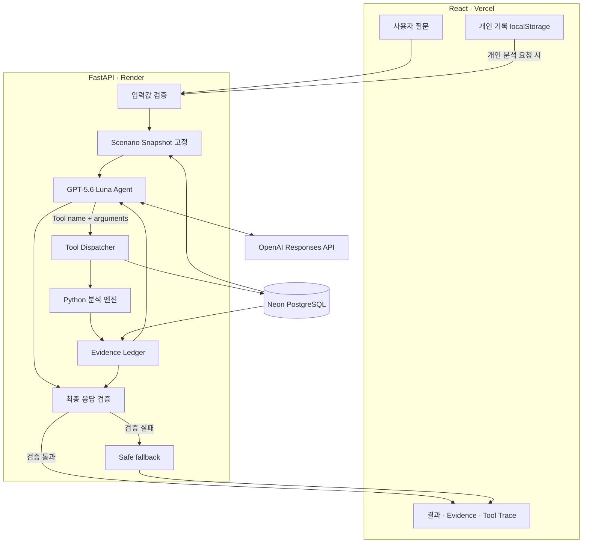
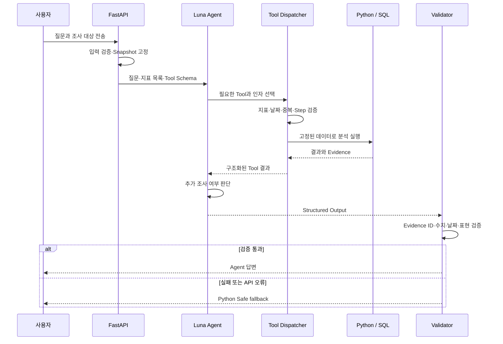

# Pet Detective 포트폴리오·학습 가이드

## 1. 프로젝트 한 문장

Pet Detective는 반려견마다 다른 평소 행동을 Personal Baseline으로 만들고, Python이 최근 변화를 계산한 뒤 GPT-5.6 Luna Agent가 사용자 질문에 필요한 Tool을 선택해 근거와 함께 설명하는 AI Agent 프로젝트다.

## 2. 완성 기준

v1.1은 2026-09-27 기준 포트폴리오 완성본이다. 다음 질문에 코드, 실행 화면과 평가 수치로 답할 수 있으면 완료로 본다.

1. 어떤 문제를 해결했는가?
2. 왜 일반 챗봇이 아니라 Agent 구조가 필요한가?
3. Python과 LLM의 책임을 어떻게 나눴는가?
4. Agent가 올바른 Tool을 선택하는지 어떻게 검증했는가?
5. 잘못된 답변과 API 장애를 어떻게 처리했는가?
6. 무료 공개 배포에서 비용을 어떻게 제한했는가?

### 완료된 범위

- 60일 합성 시나리오 3종과 변화 탐지 Ground Truth
- 최초 30일 Personal Baseline과 마지막 7일 비교
- 변화율, 절대 변화량, 효과크기, 지속 조건과 시작일 계산
- 질문별 동적 Tool 선택과 최대 4 Step Agent loop
- Structured Output, Evidence Ledger, 수치·날짜·금지 표현 검증
- API 오류나 검증 실패 시 deterministic fallback
- 실제 Luna 반복 평가, 결정론적 평가와 자동 테스트
- React, FastAPI, Neon, Render, Vercel 공개 배포
- 이름 등록, 합성 데이터 즉시 체험, 브라우저 개인 기록과 누락일 보완

### v2.0 백로그

- Neon 개인 원본 기록 저장
- 사용자 인증과 데이터 소유권
- 여러 기기 간 동기화
- 삭제·보존·동의 정책과 DB 마이그레이션
- Timeline Search와 Adaptive Baseline

이 항목들은 미완성 결함이 아니라 의도적으로 분리한 제품 확장 범위다.

## 3. 시스템 아키텍처

### 질문 한 건의 실행 순서

## 4. 구성요소별 책임

| 구성요소 | 책임 | 이 경계가 필요한 이유 |
| --- | --- | --- |
| React | 입력, 기록 관리, 진행률과 결과 표시 | 화면 상태와 분석 로직을 분리하기 위해 |
| FastAPI | API 계약, 입력 검증, Agent 실행 제어 | 모델에 들어가기 전 잘못된 요청을 차단하기 위해 |
| Neon PostgreSQL | 합성 시나리오와 익명 실행 메타데이터 저장 | 서버 재시작 뒤에도 평가 데이터와 비용 집계를 유지하기 위해 |
| Python 분석 엔진 | Baseline, 변화량, 지속성, 시작일 계산 | 수치 계산을 재현 가능하고 테스트 가능하게 만들기 위해 |
| Luna Agent | 질문 해석, Tool·인자·순서 선택, 설명 작성 | 자연어 질문마다 필요한 조사 과정이 다르기 때문에 |
| Tool Dispatcher | 허용 인자, Snapshot, 중복, Step 제한 | LLM이 임의 데이터나 함수를 사용하지 못하게 하기 위해 |
| Evidence Ledger | 실제 Tool이 반환한 근거 누적 | 호출하지 않은 정보로 답하는 것을 막기 위해 |
| Validator | Evidence ID, 숫자, 날짜, 인과·진단 표현 검사 | 구조화된 응답도 내용이 틀릴 수 있기 때문에 |
| Safe fallback | 검증 실패와 API 장애 시 계산 결과 반환 | LLM 실패가 서비스 전체 실패가 되지 않게 하기 위해 |

## 5. 왜 RAG가 아닌가

RAG는 문서 검색 결과를 LLM 입력에 넣어 답을 생성하는 구조다. Pet Detective의 핵심 정보는 긴 문서가 아니라 날짜별 수치와 이벤트다. 필요한 작업도 의미 기반 문서 검색보다 Baseline 계산, 기간 비교와 변화 시작일 탐지다.

따라서 이 프로젝트는 Vector DB 기반 RAG 대신 Tool Calling을 사용한다. Luna는 질문에 맞는 분석 Tool을 선택하고 Python과 SQL이 정확한 값을 반환한다. 이벤트 설명이 대량의 비정형 문서로 확장되면 그때 RAG를 별도 Tool로 추가할 수 있다.

## 6. Agent 정확도를 높인 방법

### 평가 계약

각 질문에 다음 정답을 사람이 먼저 작성했다.

- 반드시 호출해야 하는 Tool
- 호출해도 되는 Tool
- Tool별 지표와 이벤트 종류
- 선행되어야 하는 호출 순서
- 허용하지 않는 주장 유형

이 정답 묶음이 Agent Routing Ground Truth다.

### 개선 과정

1. 모든 Tool을 고정 호출하던 기준선을 측정했다.
2. Luna가 질문별로 Tool과 인자를 선택하도록 변경했다.
3. 개발 세트의 실패를 보고 Tool 설명과 Agent 지침을 개선했다.
4. 별도의 보류 세트로 일반화 여부를 확인했다.
5. 실패를 확인한 보류 세트는 이후 회귀 세트로 구분했다.
6. 새로운 확인용 질문과 표적 회귀 질문으로 발견한 경계 사례를 다시 검증했다.

### 결과를 읽는 방법

| 평가 | 결과 | 의미 |
| --- | ---: | --- |
| 고정 정책 Tool Precision | 30.0% | 질문과 무관한 Tool을 많이 호출함 |
| 고정 정책 불필요 호출률 | 70.0% | 비용과 설명 복잡도가 불필요하게 증가함 |
| 반복 평가 Tool Recall | 97.0% | 필요한 Tool의 대부분을 호출함 |
| 반복 평가 Tool Precision | 100% | 호출한 Tool은 모두 질문에 허용됨 |
| 반복 평가 인자 정확도 | 97.0% | 선택한 지표·종류가 Ground Truth와 대부분 일치함 |
| 반복 평가 응답 채택률 | 96.7% | 서버 검증을 통과해 사용자에게 전달된 비율 |
| 결정론적 변화 탐지 F1 | 1.0 | 고정 평가 데이터의 변화 방향을 모두 맞춤 |
| Unsupported Claim Rate | 0% | 고정 평가에서 근거 없는 주장이 없음 |

이 수치는 제한된 합성 데이터와 평가 문항에서 얻은 결과다. 실제 모든 사용자 질문에 대한 100% 정확도를 뜻하지 않는다.

## 7. 데이터가 37일 필요한 이유

최초 30일은 반려견 개인의 평소 범위를 계산하는 Baseline이다. 마지막 7일은 현재 상태를 나타내는 별도 비교 구간이다. 같은 데이터를 기준과 비교에 동시에 사용하면 변화가 희석되므로 두 구간을 분리했다.

| 기록 수 | 제공 기능 |
| --- | --- |
| 1일 | 오늘 기록 저장과 조회 |
| 2~6일 | 기록 추이와 누락 날짜 확인 |
| 7~29일 | 최근 기록 요약과 Baseline 진행률 |
| 30~36일 | Baseline 완성, 비교 구간 수집 |
| 37일 이상 | 변화 탐지와 Agent 조사 |

데이터가 부족할 때 변화 결과를 생성하지 않는 것은 기능 부족이 아니라 성급한 AI 판단을 막는 정책이다. 공개 방문자는 60일 합성 시나리오로 즉시 전체 흐름을 체험할 수 있다.

## 8. 비용과 운영 설계

- Agent Tool 호출 최대 4회
- 출력 토큰 상한
- IP별 분당 Rate Limit
- Neon의 실행 기록을 이용한 일일 Agent 호출 상한
- OpenAI 대시보드의 월 예산 한도
- 검증 실패 응답도 비용 집계에 포함
- Render 무료 인스턴스의 절전을 허용하고 UI에서 콜드 스타트를 안내

설명 문장:

> 공개 Agent의 비용을 제한하려면 요청 단위 Step 제한, 서버의 일일 호출 상한과 공급자 월 예산이 함께 필요합니다. 메모리 카운터는 무료 서버가 재시작되면 초기화되므로 일일 사용량은 Neon에서 집계했습니다.

## 9. 이력서용 문장

### 한 줄 제목

**Pet Detective — 개인 Baseline 기반 반려견 행동 변화 분석 AI Agent**

### 이력서용 3개 항목

- Python 기반 Personal Baseline·지속성 변화 탐지와 GPT-5.6 Luna Tool Calling을 결합해 질문별 분석 경로를 선택하는 AI Agent를 설계·배포
- Evidence Ledger와 Structured Output 검증으로 Tool 근거에 없는 숫자·날짜·인과·진단 표현을 차단하고 실패 시 deterministic fallback 제공
- 30개 Agent Routing 평가 문항과 반복 실행을 구축해 고정 정책 대비 Tool Precision을 30%에서 100%로 개선하고, 반복 평가 Tool Recall 97%, 응답 채택률 96.7% 측정

### 기술 스택

`Python`, `FastAPI`, `Pydantic`, `SQLAlchemy`, `PostgreSQL/Neon`, `OpenAI Responses API`, `React`, `TypeScript`, `Vite`, `Pytest`, `Docker`, `Render`, `Vercel`

## 10. 프로젝트 소개 답변

### 30초 소개

> 반려견마다 평소 행동이 다르기 때문에 고정 임계값 대신 최초 30일의 Personal Baseline과 최근 7일을 비교하는 행동 변화 분석 Agent를 만들었습니다. 통계 계산은 Python이 담당하고, GPT-5.6 Luna는 사용자 질문에 필요한 Tool을 선택해 관련 근거를 조사합니다. 최종 답변은 Evidence ID와 수치·날짜를 서버에서 다시 검증하고, 실패하면 계산 기반 fallback으로 전환합니다. 실제 모델 평가에서 Tool 선택 정밀도 100%, 필수 Tool 재현율 97%를 기록했고 Vercel, Render, Neon으로 공개 배포했습니다.

### 2분 소개

> 문제는 같은 행동 수치라도 반려견마다 정상 범위가 다르다는 점에서 시작했습니다. 그래서 최초 30일로 개인 Baseline을 만들고 최근 7일의 평균, 절대 변화량, 효과크기와 지속 조건을 함께 검사합니다. 이 계산은 재현성과 테스트가 중요한 영역이기 때문에 LLM이 아니라 Python으로 구현했습니다.
>
> Luna Agent는 사용자의 자연어 질문을 해석해 `get_baseline`, `detect_changes`, `compare_periods`, `get_events` 중 필요한 Tool과 지표를 선택합니다. 실행한 Tool의 결과만 Evidence Ledger에 누적하고, 최종 문장이 인용한 Evidence ID, 숫자와 날짜가 실제 근거에 있는지 서버가 검증합니다. 질병 진단이나 인과관계 확정 요청은 범위 밖으로 처리하고, API 오류나 검증 실패 시 Python 결과를 이용한 fallback을 제공합니다.
>
> Agent 품질은 느낌으로 판단하지 않고 질문별 필수 Tool, 허용 Tool, 인자와 순서를 Ground Truth로 만든 뒤 측정했습니다. 고정 4-Tool 정책은 Tool Precision이 30%였지만 동적 구조의 반복 평가에서는 100%로 개선됐고, 필수 Tool Recall 97%, 응답 채택률 96.7%를 기록했습니다. 공개 데모 비용을 제한하기 위해 Step, Rate Limit, 일일 호출량과 월 예산도 함께 제어했습니다.

## 11. 예상 면접 질문과 답변

### Q. LLM이 분석까지 전부 하면 더 간단하지 않나요?

수치 계산을 LLM에 맡기면 같은 입력에서도 결과가 달라지고 계산 근거를 단위 테스트하기 어렵다. 그래서 Python을 진실의 원천으로 두고 Luna는 질문 해석, Tool 선택과 설명에 집중시켰다.

### Q. 이것이 정말 Agent인가요?

서버가 고정 순서로 함수를 실행하는 것이 아니라 Luna가 질문에 따라 Tool, 인자, 호출 순서와 추가 조사 여부를 결정한다. 서버는 실행 권한과 검증 경계만 제공하므로 제한된 범위의 Tool-using Agent다.

### Q. RAG를 사용했나요?

사용하지 않았다. 핵심 데이터가 문서가 아니라 시계열 수치이고 필요한 연산이 검색보다 통계 계산이기 때문이다. 비정형 기록이 대량으로 쌓이면 이벤트 검색을 RAG Tool로 확장할 수 있다.

### Q. Agent의 정확도는 어떻게 확인했나요?

질문별 필수·허용 Tool, 인자와 순서를 Ground Truth로 만들고 Tool Recall, Precision, 불필요 호출률, 인자 정확도와 최종 응답 채택률을 측정했다. 개발 세트, 보류 세트와 회귀 세트를 구분해 같은 문제에 과도하게 맞추는 위험도 기록했다.

### Q. 잘못된 답변을 완전히 막았나요?

완전한 무오류를 주장하지 않는다. Tool Schema와 Dispatcher로 행동 범위를 제한하고, Evidence 기반 검증과 fallback으로 오류가 사용자에게 전달될 가능성을 줄였다. 실제 정확도 한계는 평가 수치와 실패 사례를 함께 공개했다.

### Q. 왜 사용자 기록을 Neon에 저장하지 않았나요?

v1.1의 목적은 Agent 오케스트레이션과 평가 능력을 증명하는 것이다. 개인 원본 데이터를 저장하면 인증, 소유권, 삭제·보존 정책과 마이그레이션이 새로운 핵심 범위가 된다. 이 작업은 AI 핵심을 직접 강화하지 않아 v2.0으로 분리했고, 현재 Neon에는 합성 시나리오와 익명 실행 메타데이터만 저장한다.

### Q. 합성 데이터 평가가 실제 성능을 보장하나요?

보장하지 않는다. 합성 데이터는 변화 시작일과 방향의 Ground Truth를 정확히 알고 결정론적으로 회귀 테스트할 수 있다는 장점이 있다. 실제 서비스 전환에는 실제 사용자 데이터의 동의된 표본, 라벨링 기준, 데이터 드리프트 모니터링이 추가로 필요하다.

### Q. 가장 의미 있었던 개선은 무엇인가요?

모든 Tool을 호출하던 구조를 질문별 동적 Tool 선택으로 바꾼 것이다. 평가를 먼저 만든 뒤 실패 유형을 기준으로 Tool 계약과 프롬프트를 수정했고, 불필요한 호출을 줄이면서도 필요한 Tool Recall을 유지했다.

## 12. 용어 학습

| 용어 | 쉬운 의미 | 프로젝트 예시 |
| --- | --- | --- |
| Personal Baseline | 개인별 평소 기준 | 최초 30일 행동 평균과 분산 |
| Ground Truth | 평가할 때 사용하는 사람이 정한 정답 | 질문별 필수 Tool과 인자 |
| Tool Calling | LLM이 정해진 함수를 선택해 실행 요청하는 방식 | `detect_changes(metrics=[...])` |
| Orchestration | 여러 단계와 도구의 실행 순서를 조정하는 것 | 질문 해석 → Tool → 추가 조사 → 답변 |
| Structured Output | 정해진 Schema로 받는 모델 출력 | `AgentAnswer` Pydantic 모델 |
| Evidence Ledger | 실제 수집된 근거의 요청별 장부 | Tool 실행 때 생성한 E1, E2 |
| Hallucination | 근거 없이 사실처럼 생성한 내용 | 조회하지 않은 날짜나 수치 생성 |
| Guardrail | 모델 행동을 제한하는 규칙과 코드 | 지표 enum, Step 제한, 금지 표현 |
| Dispatcher | Tool 요청을 검사하고 실제 함수를 연결하는 계층 | 인자 검증 후 Python 함수 실행 |
| Snapshot | 조사 시작 시 고정한 데이터 상태 | 모든 Tool이 같은 시나리오 사용 |
| Fallback | 주 경로 실패 시 사용하는 대체 경로 | Python 계산 리포트 |
| Precision | 실행하거나 탐지한 것 중 맞은 비율 | 호출한 Tool 중 허용된 Tool 비율 |
| Recall | 반드시 찾아야 할 것 중 찾은 비율 | 필수 Tool 중 실제 호출한 비율 |
| F1 | Precision과 Recall의 조화 평균 | 변화 탐지 종합 지표 |
| Holdout Set | 개선에 직접 사용하지 않은 확인용 문제 | 최초 보류 질문 10개 |
| Regression Test | 수정 후 기존 기능이 깨지지 않았는지 확인 | 실패 질문 반복 평가 |
| Rate Limit | 일정 시간 동안 요청 횟수를 제한 | IP별 분당 10회 |
| Cold Start | 절전 서버가 다시 켜지는 지연 | Render 첫 요청 지연 |
| Data Drift | 운영 데이터 분포가 개발 때와 달라지는 현상 | 실제 반려견 기록과 합성 데이터 차이 |

## 13. 문장으로 설명하는 연습

아래 문장을 소리 내어 말하고, 코드나 평가 파일을 근거로 덧붙인다.

- 개인별 변화를 탐지하려면 **Personal Baseline**이 필요합니다. 반려견마다 정상 행동 범위가 다르기 때문입니다.
- 재현 가능한 수치 분석을 하려면 **Python 분석 엔진**이 필요합니다. LLM의 자연어 생성은 동일한 계산 결과를 보장하지 않기 때문입니다.
- 자연어 질문마다 다른 조사를 하려면 **Tool Calling Agent**가 필요합니다. 질문에 따라 필요한 지표와 조사 단계가 달라지기 때문입니다.
- Agent의 Tool 선택을 개선하려면 **Ground Truth 평가 세트**가 필요합니다. 정답 없이 프롬프트가 좋아졌는지 수치로 비교할 수 없기 때문입니다.
- 근거 없는 답변을 줄이려면 **Evidence Ledger와 Validator**가 필요합니다. 구조화된 출력만으로는 내용의 사실성까지 보장할 수 없기 때문입니다.
- API 장애에도 서비스를 유지하려면 **Safe fallback**이 필요합니다. 외부 모델 실패가 전체 분석 실패로 이어지지 않게 해야 하기 때문입니다.
- 공개 데모의 비용을 통제하려면 **Step 제한, Rate Limit, 일일 상한과 월 예산**이 필요합니다. 하나의 제한만으로는 모든 과다 호출 경로를 막을 수 없기 때문입니다.
- Agent의 일반화 성능을 확인하려면 **개발 세트와 보류 세트의 분리**가 필요합니다. 이미 본 질문에만 맞춘 개선을 실제 성능으로 오해할 수 있기 때문입니다.

## 14. 코드 학습 순서

1. `backend/app/schemas.py`에서 요청, Evidence와 Agent 응답 계약을 읽는다.
2. `backend/app/analysis.py`에서 Baseline과 변화 탐지 계산을 읽는다.
3. `backend/app/tools.py`에서 Tool Schema, 인자 검증과 Evidence 생성을 읽는다.
4. `backend/app/agent.py`에서 Tool loop, Ledger와 최종 검증을 읽는다.
5. `evaluation/agent_cases.json`에서 질문별 Ground Truth를 확인한다.
6. `evaluation/evaluate_agent.py`에서 Recall과 Precision 계산 방식을 읽는다.
7. `backend/tests`에서 각 안전 규칙을 어떤 입력으로 검증하는지 확인한다.
8. `frontend/src/App.tsx`에서 사용자가 결과와 조사 과정을 보는 흐름을 읽는다.

각 파일을 공부한 뒤 다음 세 문장으로 정리한다.

1. 이 파일은 무엇을 책임지는가?
2. 다른 계층과 분리한 이유는 무엇인가?
3. 이 계층이 실패하면 어떤 검증이나 fallback이 동작하는가?

## 15. 최종 점검 목록

- 공개 URL에서 합성 시나리오를 선택하고 질문할 수 있다.
- Agent 결과에 사용한 Tool과 Evidence가 표시된다.
- 개인 기록은 새로고침 후 같은 브라우저에 유지된다.
- 37일 미만 기록에는 변화 결과를 만들지 않는다.
- `pytest`와 프론트엔드 production build가 통과한다.
- 평가 원본 JSON과 측정 조건이 저장소에 남아 있다.
- README에서 공개 URL, 구조, 성과와 의도적으로 제외한 범위를 확인할 수 있다.
- 이 문서의 30초 소개를 자신의 말로 설명할 수 있다.

이 목록을 통과한 현재 v1.1을 완성본으로 유지한다. 새로운 아이디어는 즉시 구현하지 않고 v2.0 백로그에 기록한 뒤, 현재 프로젝트 설명과 학습을 우선한다.
